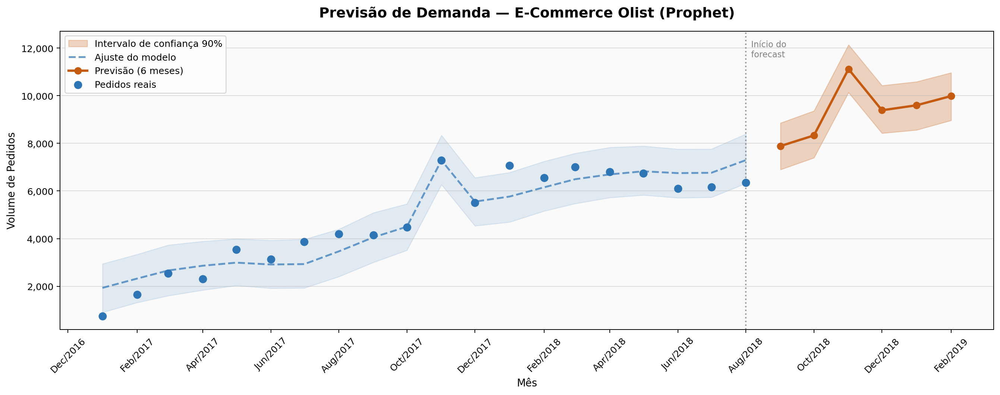
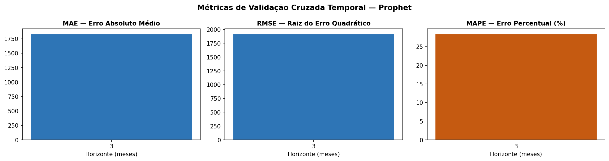
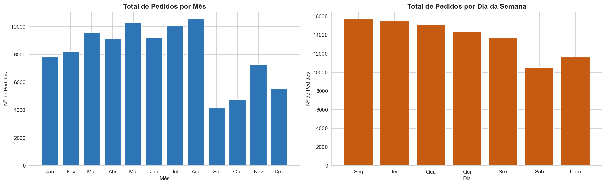

# 📦 Forecasting de Demanda — E-Commerce Brasileiro (Olist)

> Previsão de demanda com séries temporais aplicada a dados reais de e-commerce brasileiro.


---

## Sobre o Projeto

Este projeto utiliza o **dataset público da Olist** — maior plataforma de marketplace do Brasil — para construir um modelo de **previsão de demanda mensal** com foco em supply chain e logística.

O objetivo é prever o volume de pedidos futuros, auxiliando na tomada de decisão de estoque, planejamento logístico e operacional.

**Dataset:** [Brazilian E-Commerce Public Dataset by Olist](https://www.kaggle.com/datasets/olistbr/brazilian-ecommerce) — Kaggle  
**Período:** Setembro/2016 a Agosto/2018 · ~100.000 pedidos · 9 tabelas relacionais

---

## Resultado Final — Previsão 6 Meses



| Mês | Previsão | Intervalo (90%) |
|---|---|---|
| Set/2018 | 7.888 pedidos | 6.900 – 8.859 |
| Out/2018 | 8.334 pedidos | 7.395 – 9.366 |
| **Nov/2018** | **11.122 pedidos** | 10.138 – 12.143 |
| Dez/2018 | 9.391 pedidos | 8.428 – 10.430 |
| Jan/2019 | 9.601 pedidos | 8.563 – 10.591 |
| Fev/2019 | 9.988 pedidos | 8.966 – 10.969 |

> O modelo captura o pico de **Black Friday em novembro** como o principal evento de demanda do ano.

---

## Performance do Modelo

| Métrica | Valor |
|---|---|
| **MAPE** (Erro Percentual Médio) | 28,4% |
| **MAE** (Erro Absoluto Médio) | ~1.833 pedidos |
| **RMSE** | ~1.918 pedidos |
| Método de validação | Walk-forward (validação cruzada temporal) |
| Horizonte avaliado | 3 meses |



---

## Principais Insights da EDA



| Indicador | Resultado |
|---|---|
| Total de pedidos entregues | **96.478** |
| Crescimento da demanda | De **265** pedidos/mês (Out/2016) para **7.000+**/mês (2018) — crescimento ~26× |
| Pico de demanda | **Novembro/2017 — 7.289 pedidos** (Black Friday, +32% vs mês anterior) |
| Melhor dia da semana | **Segunda-feira** (15.701 pedidos acumulados) |
| Categoria líder | **Cama, Mesa & Banho** (10.953 pedidos) |
| Ticket médio | **R$ 161,38** |

---

## Metodologia

### Pipeline completo

```
data/raw/  →  01_eda.ipynb  →  02_preprocessing.ipynb  →  03_modeling.ipynb
```

### Decisões técnicas

| Decisão | Escolha | Motivo |
|---|---|---|
| Modelo | Prophet (Meta) | Robusto para séries mensais com tendência + sazonalidade; interpretável |
| Granularidade | Mensal | Dataset com 25 meses; granularidade diária geraria ruído excessivo |
| Variável alvo | `qtd_pedidos` | Volume de pedidos é mais representativo de demanda que receita |
| Filtro | `order_status == 'delivered'` | Pedidos não entregues distorcem a demanda real |
| Sazonalidade | Aditiva | Com 20 meses de dados, o modo multiplicativo extrapola excessivamente a tendência inicial |
| Validação | Walk-forward (temporal) | Evita data leakage — nunca usa dados futuros no treino |
| Eventos | Black Friday (Nov/17 e Nov/18) | Modelado como holiday no Prophet para isolar o efeito pontual |

---

## Estrutura do Projeto

```
forecasting-demanda-olist/
├── data/
│   ├── raw/                          # CSVs originais do Kaggle (não versionados)
│   └── processed/
│       ├── serie_temporal_mensal.csv # Série agregada bruta (EDA)
│       ├── serie_modelagem.csv       # Série limpa — formato Prophet (ds, y)
│       ├── feriados.csv              # Tabela de holidays (Black Friday)
│       ├── previsao_6meses.csv       # Previsão Set/2018–Fev/2019
│       ├── forecast_chart.png        # Gráfico principal
│       ├── sazonalidade.png          # Sazonalidade mensal e semanal
│       ├── metricas_validacao.png    # Métricas da validação cruzada
│       └── componentes_prophet.png   # Decomposição do modelo
├── notebooks/
│   ├── 01_eda.ipynb                  # Análise Exploratória de Dados
│   ├── 02_preprocessing.ipynb        # Limpeza e preparação para modelagem
│   └── 03_modeling.ipynb             # Modelo Prophet + avaliação + forecast
├── requirements.txt
└── README.md
```

---

## Como Executar

```bash
# 1. Clone o repositório
git clone https://github.com/RodrigoPresida/supply-chain-forecasting-olist.git
cd supply-chain-forecasting-olist

# 2. Instale as dependências
pip install -r requirements.txt

# 3. Baixe o dataset no Kaggle e coloque os CSVs em data/raw/
#    https://www.kaggle.com/datasets/olistbr/brazilian-ecommerce

# 4. Execute os notebooks em ordem
jupyter notebook notebooks/
```

> **Nota:** o diretório `data/raw/` não está versionado (CSVs totalizam ~45 MB). Faça o download direto no Kaggle.

---

## Autor

**Rodrigo Presida** — Analista / Cientista de Dados

[](https://linkedin.com/in/seu-perfil)
[](https://github.com/RodrigoPresida)
